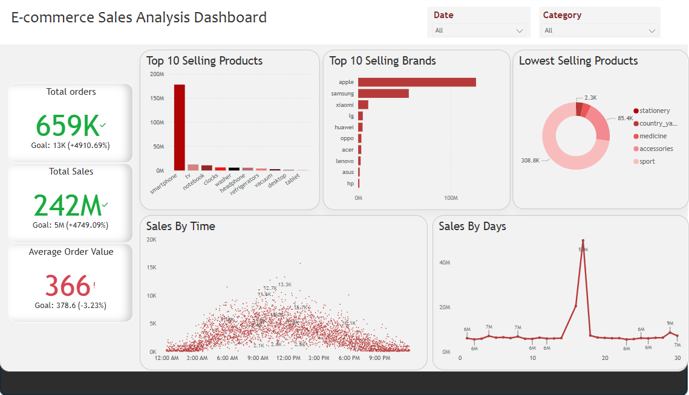

E-commerce Sales Analysis Dashboard - Power BI Project

## Project Overview
This Power BI project provides an interactive sales analysis dashboard for an online retail store.  
It is designed to help business stakeholders and management teams understand:
- **Customer purchasing behavior**
- **Sales trends over time**
- **Product performance and popularity**
- **Geographical distribution of sales**

## Dataset Details
- **Key Columns**
  - Order ID
  - Product ID
  - Product Category
  - Order Date
  - Quantity
  - Price
  - Customer ID
  - Customer Location

## Data Preparation
- Imported the dataset into Power BI from CSV/Excel
- Cleaned data:
  - Handled missing values
  - Corrected data types
  - Removed duplicate records
- Created calculated columns:
  - `Total Sales = Quantity * Price`
  - `Average Order Value = Total Sales / Number of Orders`
  - 
## Analysis Objectives

- **Sales Performance**
  - Total Sales
  - Number of Orders
  - Average Order Value (AOV)
- **Customer Insights**:
  - Top 10 Customers by Total Spend
  - Most Popular Product Categories
- **Geographical Analysis**:
  - Sales distribution by country or region
- **Product Analysis**:
  - Top-Selling Products
  - Low-Performing Products (by quantity)

## Visualizations Included

- **KPIs**:
  - Total Sales
  - Total Orders
  - Average Order Value
- **Bar Charts**:
  - Sales by Product Category
- **Map Visualization**:
  - Sales by Customer Location
- **Line Chart**:
  - Daily/Monthly Sales Trends

## Interactivity Features

- **Slicers** for filtering by
  - Date Range
  - Product Category
- **Drill-through Pages**
  - Product-level details
  - Customer-level details
    
## Data Source: Kaggle E-commerce Dataset (CSV/Excel)
## Dataset Link: https://www.kaggle.com/datasets/mkechinov/ecommerce-behavior-data-from-multi-category-store
## 🖼️ Dashboard Preview

